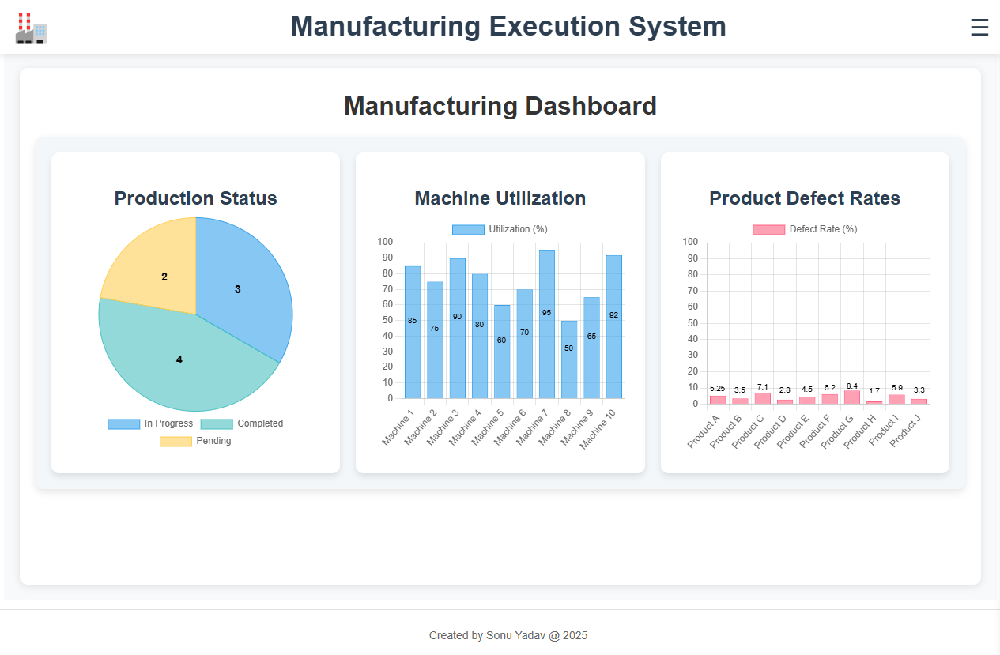
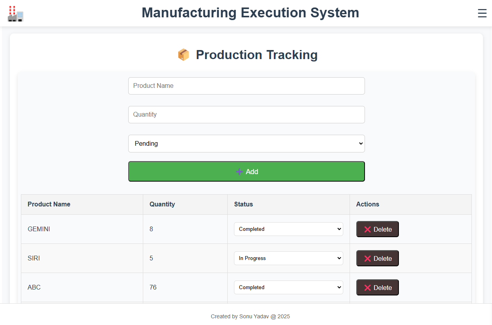
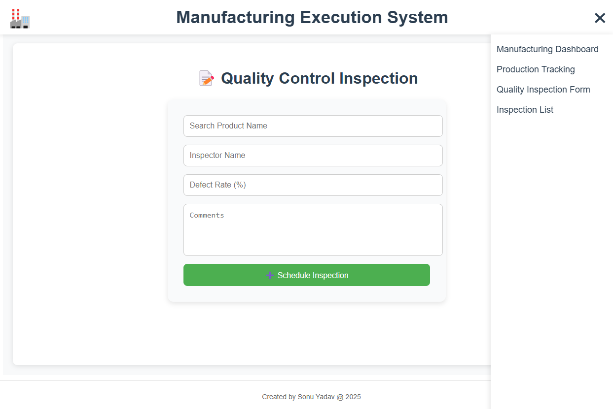
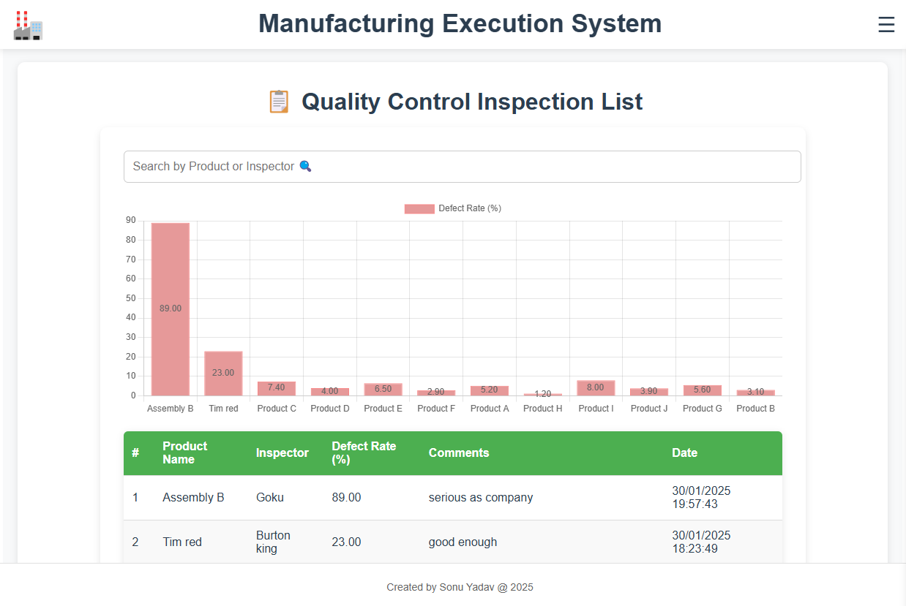

# Manufacturing Execution System (MES) Module

## Overview

This project is a **Manufacturing Execution System (MES) module** designed using modern web technologies. It includes a **dashboard, production tracking, and quality control module**, allowing users to monitor and manage key manufacturing processes efficiently.

### Technologies Used:
- **Frontend**: Vue.js, Tailwind CSS  
- **Backend**: ExpressJS (NodeJS)  
- **Database**: PostgreSQL  

---

## Features

### 1. Dashboard
- **Objective**: Provide an overview of key manufacturing metrics.
- **Features**:
  - Displays production status, machine utilization, and product defect rates.
  - Uses simple charts or graphs for visualization.
  - Fully responsive and user-friendly.



### 2. Production Tracking
- **Objective**: Track the production process from raw materials to finished goods.
- **Features**:
  - Tracks production flow and scheduling.
  - Provides real-time updates on production status.
  - Implements **CRUD (Create, Read, Update, Delete)** operations for production records.



### 3. Quality Control
- **Objective**: Manage quality control inspections.
- **Features**:
  - Schedule and track quality control inspections.
  - Record inspection results and flag defects.
  - Generate simple reports on quality control metrics.




---

## Setup Instructions

### 1. Prerequisites  
Ensure you have the following installed:  
- [Node.js](https://nodejs.org/) (v16+ recommended)  
- [PostgreSQL](https://www.postgresql.org/)  
- [Docker](https://www.docker.com/) (if containerizing the application)  

### 2. Clone the Repository  
```bash
git clone https://github.com/sonu-yadavv/mes-system.git
cd mes-system
```
### 3. Install Dependencies
```bash
npm install express pg cor
cd frontend
npm install
```

### 3. Run the Application
```bash
node index.js
cd frontend
npm run serve
```
### Build Docker Images
```bash
docker-compose up --build
docker-compose up -d